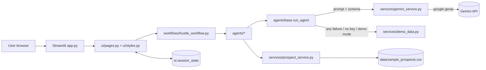
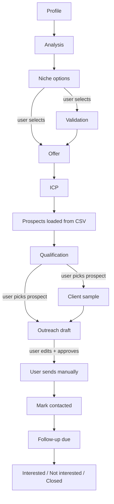
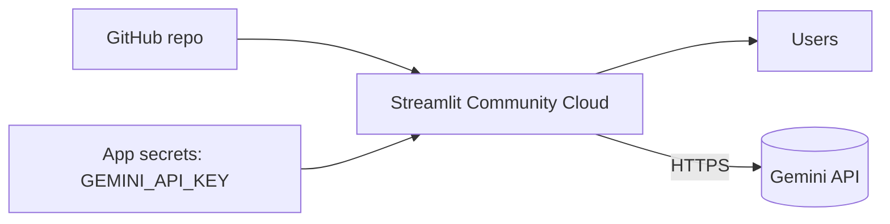

# Architecture

## System architecture
A single Streamlit app (server-side Python) holds all state in `st.session_state`. It calls the Gemini API for AI steps and reads one local CSV. There is no database and no outbound messaging.

## Agent architecture and responsibilities

| Agent | Responsibility | Input | Output |
|-------|---------------|-------|--------|
| Profile Analysis | Assess skills, time, strengths, limits, portfolio | `UserProfileInput` | `ProfileAnalysis` |
| Niche Discovery | Propose 4 niches with trade-offs | profile, analysis | `NicheList` |
| Niche Validation | Stress-test the chosen niche; split assumptions from verification steps | profile, niche | `NicheValidation` |
| Offer Builder | Productised offer, 3 packages, example pricing | profile, niche, validation | `Offer` |
| ICP | Describe the ideal client | profile, niche, offer | `ICP` |
| Prospect Qualification | Score demo prospects against the ICP | prospects, ICP, offer | `{prospect_id: ProspectQualification}` |
| Client Sample | Personalised value sample idea | prospect, offer, qualification | `ClientSample` |
| Outreach Campaign | Email + 2 follow-ups | profile, prospect, offer, qualification, sample | `OutreachCampaign` |
| Follow-up / Lead Mgmt | Status transitions, due dates, metrics | leads dict | metrics, table (no AI) |

## Workflow
`workflows/hustle_workflow.py` defines the ordered `STEPS`, each with a completion test and an optional prerequisite. Pages call `missing_prerequisite()` to gate themselves and `run_*()` functions to execute one agent and store the result plus its source (`live` or `demo`). Choosing a different niche clears everything downstream so stale data never mixes.

LangGraph was evaluated and deliberately not used: the pipeline is linear, every branch is a human decision, and each step is a single call. A graph framework would add a dependency and failure modes without adding capability. If automatic branching or parallel research is added later, `run_*` functions map directly to graph nodes.

## Gemini integration
- `google-genai` SDK: `genai.Client(api_key=..., http_options=HttpOptions(timeout=...))` and `client.models.generate_content(model, contents, config=GenerateContentConfig(system_instruction, temperature, response_mime_type="application/json"))`.
- Model name comes from `config/settings.py` (`GEMINI_MODEL`, default alias `gemini-flash-latest`).
- Key lookup: sidebar (session) -> `st.secrets` -> environment/`.env`. Never hardcoded, never logged.
- Errors are classified (`missing_key`, `invalid_key`, `rate_limit`, `network`, `model`, `empty`, `invalid`, `sdk`, `api`) and mapped to fixed, safe user messages. Transient errors retry once.

## Pydantic structured outputs
Each agent has a schema in `models/schemas.py`. The prompt appends the model's JSON Schema; the reply is parsed (code fences stripped, outer braces recovered) and validated. `AIModel` normalises common LLM quirks (null, list-instead-of-string, numeric text) and each schema lists `REQUIRED` fields. A malformed or incomplete reply triggers one corrective retry, then the fallback. Lists of items are wrapped in container models (`NicheList`, `QualificationList`) to keep the schema simple.

## State management
`utils/helpers.py::STATE_DEFAULTS` declares every session key (profile, analysis, niches, selected niche, validation, offer, ICP, prospects, qualifications, samples, campaigns, leads, sources, UI flags). Programmatic navigation uses a `goto` key consumed before the sidebar radio is created. "Reset everything" clears the session.

## Prospect qualification
Qualification sends compact prospect records (no contact emails) in one call. Any prospect the model omits receives a transparent keyword-overlap score from `demo_data.qualification_heuristic` (industry, country, fit signals, decision-maker role). The same heuristic powers Demo/Fallback Mode. Results show score, level (Strong/Moderate/Weak), qualification flag, reasons, signals found and problems.

## Client sample generation
One call per selected prospect returns post copy, reel idea, caption, CTA, design direction and rationale. The UI labels it *AI-generated sample idea* and states it has not been delivered.

## Outreach generation
One call per prospect returns subject, first email, two follow-ups (days 3 and 7), CTA, personalization notes and timing. Prompts forbid generic salutations, hype, guarantees and claims of work not done. A phrase scan flags risky wording in the user's edited text. Bulk generation is capped (`MAX_BULK_CAMPAIGNS`).

## Follow-up management
`followup_agent.py` is deterministic: `mark_contacted` sets a follow-up date, `refresh_due` promotes Contacted leads whose date has arrived to Follow-up Due on each run, `schedule_followup` and `set_status` support manual control, and `dashboard_metrics` feeds the cards. Each lead keeps a short activity history.

## Human approval
There is no send function anywhere. Copy, "Open in my email app" (mailto with no recipient) and "Mark as contacted" appear only after the user presses **Approve** on a draft they can edit.

## Streamlit architecture
`app.py` -> `st.set_page_config`, CSS injection, `init_state`, navigation handling, sidebar (radio navigation, progress, AI settings, reset), then a route table to `ui/pages.py`. Page code is wrapped so an unexpected exception shows a friendly message instead of a traceback. Dynamic text rendered through HTML is escaped.

## Deployment architecture

Entry point `app.py`; dependencies from `requirements.txt`; secrets via the Cloud Secrets panel; theme from `.streamlit/config.toml`.
